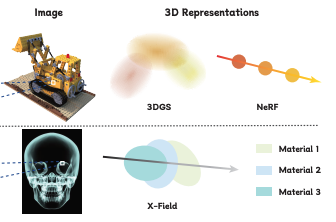
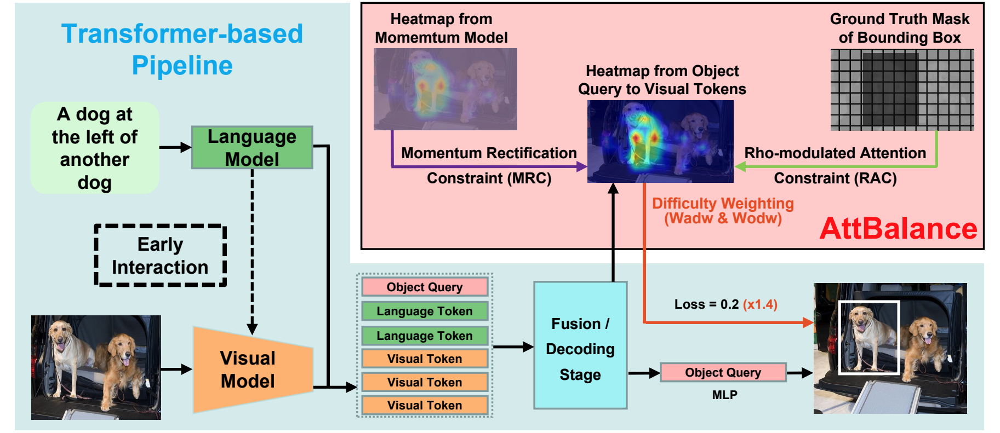

<h1 id="publications"></h1>

<h2 style="margin: 60px 0px -15px;">Publications <temp style="font-size:15px;">[</temp><a href="https://scholar.google.com/citations?user=JlbNwMAAAAAJ" target="_blank" style="font-size:15px;">Google Scholar</a><temp style="font-size:15px;">]</temp></h2>

<ol class="bibliography">

<li>
  

    

      
      <abbr class="badge">arXiv</abbr>
    

    

      
X-Field: A Physically Grounded Representation for 3D X-ray Reconstruction

      

        Feiran Wang*, Jiachen Tao*, <strong><u>Junyi Wu</u>*</strong>, Haoxuan Wang, Bin Duan, Kai Wang, Zongxin Yang, Yan Yan
         
      

      

        <em>arXiv, Mar. 2025.</em>
      

      <a href="https://arxiv.org/abs/2503.08596" class="btn btn-sm z-depth-0" role="button" target="_blank" style="font-size:16px;">Paper </a>
      <a href="https://github.com/Brack-Wang/X-Field" class="btn btn-sm z-depth-0" role="button" target="_blank" style="font-size:16px;">Code </a>
      <a href="https://brack-wang.github.io/XField/" class="btn btn-sm z-depth-0" role="button" target="_blank" style="font-size:16px;">Project Page </a>
      <a href="@misc{wang2025xfieldphysicallygroundedrepresentation,
      title={X-Field: A Physically Grounded Representation for 3D X-ray Reconstruction}, 
      author={Feiran Wang and Jiachen Tao and Junyi Wu and Haoxuan Wang and Bin Duan and Kai Wang and Zongxin Yang and Yan Yan},
      year={2025},
      eprint={2503.08596},
      archivePrefix={arXiv},
      primaryClass={cs.CV},
      url={https://arxiv.org/abs/2503.08596}, 
}" class="btn btn-sm z-depth-0" role="button" target="_blank" style="font-size:16px;">BibTex </a>
    

  

</li>

<li>
  

    

      
      <abbr class="badge">NeurIPS 2024</abbr>
    

    

      
PTQ4DiT: Post-training Quantization for Diffusion Transformers

      

        <strong><u>Junyi Wu</u>*</strong>, Haoxuan Wang*, Yuzhang Shang, Mubarak Shah, Yan Yan
         
      

      

        <em>Conference on Neural Information Processing Systems <strong>(NeurIPS)</strong>, 2024.</em>
      

      <a href="https://arxiv.org/abs/2405.16005" class="btn btn-sm z-depth-0" role="button" target="_blank" style="font-size:16px;">Paper </a>
      <a href="https://github.com/adreamwu/PTQ4DiT" class="btn btn-sm z-depth-0" role="button" target="_blank" style="font-size:16px;">Code </a>
      <a href="https://scholar.google.com/scholar?hl=zh-CN&as_sdt=0%2C14&q=ptq4dit&btnG=#d=gs_cit&t=1727458435846&u=%2Fscholar%3Fq%3Dinfo%3AKxBBml7SdQoJ%3Ascholar.google.com%2F%26output%3Dcite%26scirp%3D0%26hl%3Dzh-CN" class="btn btn-sm z-depth-0" role="button" target="_blank" style="font-size:16px;">BibTex </a>
    

  

</li>

<li>
  

    

      
      <abbr class="badge">ECCV 2024</abbr>
    

    

      
Dataset Quantization with Active Learning based Adaptive Sampling

      

        Zhenghao Zhao, Yuzhang Shang, <strong><u>Junyi Wu</u></strong>, Yan Yan
         
      

      

        <em>European Conference on Computer Vision <strong>(ECCV)</strong>, 2024.</em>
      

      <a href="https://arxiv.org/abs/2407.07268" class="btn btn-sm z-depth-0" role="button" target="_blank" style="font-size:16px;">Paper </a>
      <a href="https://github.com/ichbill/DQAS" class="btn btn-sm z-depth-0" role="button" target="_blank" style="font-size:16px;">Code </a>
      <a href="https://scholar.google.com/scholar?hl=zh-CN&as_sdt=0%2C14&q=Dataset+Quantization+with+Active+Learning+based+Adaptive+Sampling&btnG=#d=gs_cit&t=1727458837443&u=%2Fscholar%3Fq%3Dinfo%3AwEJCucJ-7xYJ%3Ascholar.google.com%2F%26output%3Dcite%26scirp%3D0%26hl%3Dzh-CN" class="btn btn-sm z-depth-0" role="button" target="_blank" style="font-size:16px;">BibTex </a>
    

  

</li>

<li>
  

    

      
      <abbr class="badge">arXiv</abbr>
    

    

      
AttBalance: Visual Grounding with Attention-Driven Constraint Balancing

      

        Weitai Kang, Luowei Zhou, <strong><u>Junyi Wu</u></strong>, Changchang Sun, Yan Yan
         
      

      

        <em>arXiv, July 2024.</em>
      

      <a href="https://arxiv.org/abs/2407.03243" class="btn btn-sm z-depth-0" role="button" target="_blank" style="font-size:16px;">Paper </a>
      <a href="https://scholar.google.com/scholar?hl=zh-CN&as_sdt=0%2C14&as_vis=1&q=Visual+Grounding+with+Attention-Driven+Constraint+Balancing&btnG=#d=gs_cit&t=1730233253783&u=%2Fscholar%3Fq%3Dinfo%3AYQ42vh1xGB0J%3Ascholar.google.com%2F%26output%3Dcite%26scirp%3D0%26hl%3Dzh-CN" class="btn btn-sm z-depth-0" role="button" target="_blank" style="font-size:16px;">BibTex </a>
    

  

</li>

<li>
  

    

      
      <abbr class="badge">arXiv</abbr>
    

    

      
QuEST: Low-bit Diffusion Model Quantization via Efficient Selective Finetuning

      

        Haoxuan Wang, Yuzhang Shang, Zhihang Yuan, <strong><u>Junyi Wu</u></strong>, Yan Yan
         
      

      

        <em>arXiv, Feb. 2024.</em>
      

      <a href="https://arxiv.org/abs/2402.03666" class="btn btn-sm z-depth-0" role="button" target="_blank" style="font-size:16px;">Paper </a>
      <a href="https://github.com/hatchetProject/QuEST" class="btn btn-sm z-depth-0" role="button" target="_blank" style="font-size:16px;">Code </a>
      <a href="https://scholar.google.com/scholar?q=QuEST:+Low-bit+Diffusion+Model+Quantization+via+Efficient+Selective+Finetuning&hl=zh-CN&as_sdt=0&as_vis=1&oi=scholart#d=gs_cit&t=1727458780245&u=%2Fscholar%3Fq%3Dinfo%3AaV0DbbUKYygJ%3Ascholar.google.com%2F%26output%3Dcite%26scirp%3D0%26hl%3Dzh-CN" class="btn btn-sm z-depth-0" role="button" target="_blank" style="font-size:16px;">BibTex </a>
    

  

</li>

<li>
  

    

      
      <abbr class="badge">CVPR 2024</abbr>
    

    

      
On the Faithfulness of Vision Transformer Explanations

      

        <strong><u>Junyi Wu</u></strong>, Weitai Kang, Hao Tang, Yuan Hong, Yan Yan
         
      

      

        <em>IEEE/CVF Conference on Computer Vision and Pattern Recognition <strong>(CVPR)</strong>, 2024.</em>
      

      <a href="https://arxiv.org/abs/2404.01415" class="btn btn-sm z-depth-0" role="button" target="_blank" style="font-size:16px;">Paper </a>
      <a href="https://github.com/adreamwu/SaCo" class="btn btn-sm z-depth-0" role="button" target="_blank" style="font-size:16px;">Code </a>
      <a href="https://scholar.google.com/scholar?hl=zh-CN&as_sdt=0%2C14&q=on+the+faithfulness+of+vision+transformer+explanation&btnG=#d=gs_cit&t=1727459212581&u=%2Fscholar%3Fq%3Dinfo%3AIojFgnKe-lsJ%3Ascholar.google.com%2F%26output%3Dcite%26scirp%3D0%26hl%3Dzh-CN" class="btn btn-sm z-depth-0" role="button" target="_blank" style="font-size:16px;">BibTex </a>
    

  

</li>

<li>
  

    

      
      <abbr class="badge">CVPR 2024</abbr>
    

    

      
Token Transformation Matters: Towards Faithful Post-hoc Explanation for Vision Transformer

      

        <strong><u>Junyi Wu</u></strong>, Bin Duan, Weitai Kang, Hao Tang, Yan Yan
         
      

      

        <em>IEEE/CVF Conference on Computer Vision and Pattern Recognition <strong>(CVPR)</strong>, 2024.</em>
      

      <a href="https://arxiv.org/abs/2403.14552" class="btn btn-sm z-depth-0" role="button" target="_blank" style="font-size:16px;">Paper </a>
      <a href="https://scholar.google.com/scholar?hl=zh-CN&as_sdt=0%2C14&q=Token+Transformation+Matters%3A+Towards+Faithful+Post-hoc+Explanation+for+Vision+Transformer&btnG=#d=gs_cit&t=1727459035450&u=%2Fscholar%3Fq%3Dinfo%3AckRIY2nHNY0J%3Ascholar.google.com%2F%26output%3Dcite%26scirp%3D0%26hl%3Dzh-CN" class="btn btn-sm z-depth-0" role="button" target="_blank" style="font-size:16px;">BibTex </a>
    

  

</li>

