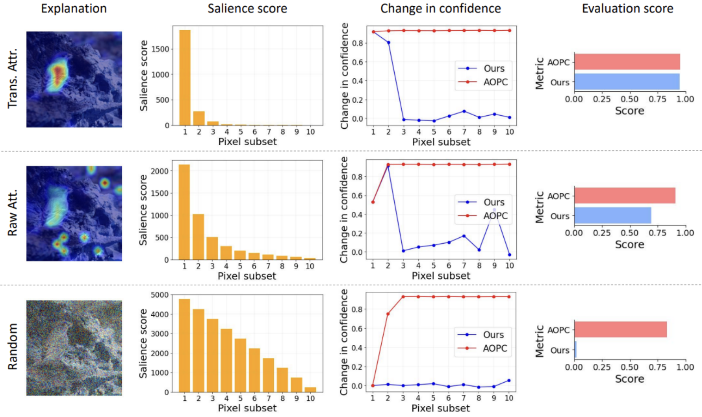

<h1 id="publications"></h1>

<h2 style="margin: 60px 0px -15px;">Publications <temp style="font-size:15px;">[</temp><a href="https://scholar.google.com/citations?user=JlbNwMAAAAAJ" target="_blank" style="font-size:15px;">Google Scholar</a><temp style="font-size:15px;">]</temp></h2>

<ol class="bibliography">

<li>
  

    

      
      <abbr class="badge">NeurIPS 2024</abbr>
    

    

      
PTQ4DiT: Post-training Quantization for Diffusion Transformers

      

        <strong><u>Junyi Wu</u>*</strong>, Haoxuan Wang*, Yuzhang Shang, Mubarak Shah, Yan Yan
         
      

      

        <em>Conference on Neural Information Processing Systems <strong>(NeurIPS)</strong>, 2024.</em>
      

      <a href="https://arxiv.org/abs/2405.16005" class="btn btn-sm z-depth-0" role="button" target="_blank" style="font-size:16px;">Paper</a>
      <a href="https://github.com/adreamwu/PTQ4DiT" class="btn btn-sm z-depth-0" role="button" target="_blank" style="font-size:16px;">Code</a>
      <a href="https://scholar.google.com/scholar?hl=zh-CN&as_sdt=0%2C14&q=ptq4dit&btnG=#d=gs_cit&t=1727458435846&u=%2Fscholar%3Fq%3Dinfo%3AKxBBml7SdQoJ%3Ascholar.google.com%2F%26output%3Dcite%26scirp%3D0%26hl%3Dzh-CN" class="btn btn-sm z-depth-0" role="button" target="_blank" style="font-size:16px;">BibTex</a>
    

  

</li>

<li>
  

    

      
      <abbr class="badge">ECCV 2024</abbr>
    

    

      
Dataset Quantization with Active Learning based Adaptive Sampling

      

        Zhenghao Zhao, Yuzhang Shang, <strong><u>Junyi Wu</u></strong>, Yan Yan
         
      

      

        <em>European Conference on Computer Vision <strong>(ECCV)</strong>, 2024.</em>
      

    

  

</li>

<li>
  

    

      
      <abbr class="badge">arXiv</abbr>
    

    

      
QuEST: Low-bit Diffusion Model Quantization via Efficient Selective Finetuning

      

        Haoxuan Wang, Yuzhang Shang, Zhihang Yuan, <strong><u>Junyi Wu</u></strong>, Yan Yan
         
      

      

        <em>arXiv, Feb. 2024.</em>
      

    

  

</li>

<li>
  

    

      
      <abbr class="badge">CVPR 2024</abbr>
    

    

      
On the Faithfulness of Vision Transformer Explanations

      

        <strong><u>Junyi Wu</u></strong>, Weitai Kang, Hao Tang, Yuan Hong, Yan Yan
         
      

      

        <em>IEEE/CVF Conference on Computer Vision and Pattern Recognition <strong>(CVPR)</strong>, 2024.</em>
      

    

  

</li>

<li>
  

    

      
      <abbr class="badge">CVPR 2024</abbr>
    

    

      
Token Transformation Matters: Towards Faithful Post-hoc Explanation for Vision Transformer

      

        <strong><u>Junyi Wu</u></strong>, Bin Duan, Weitai Kang, Hao Tang, Yan Yan
         
      

      

        <em>IEEE/CVF Conference on Computer Vision and Pattern Recognition <strong>(CVPR)</strong>, 2024.</em>
      

    

  

</li>

