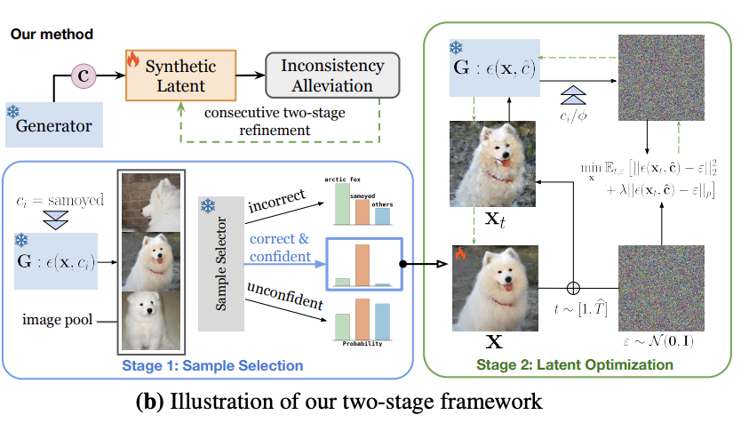
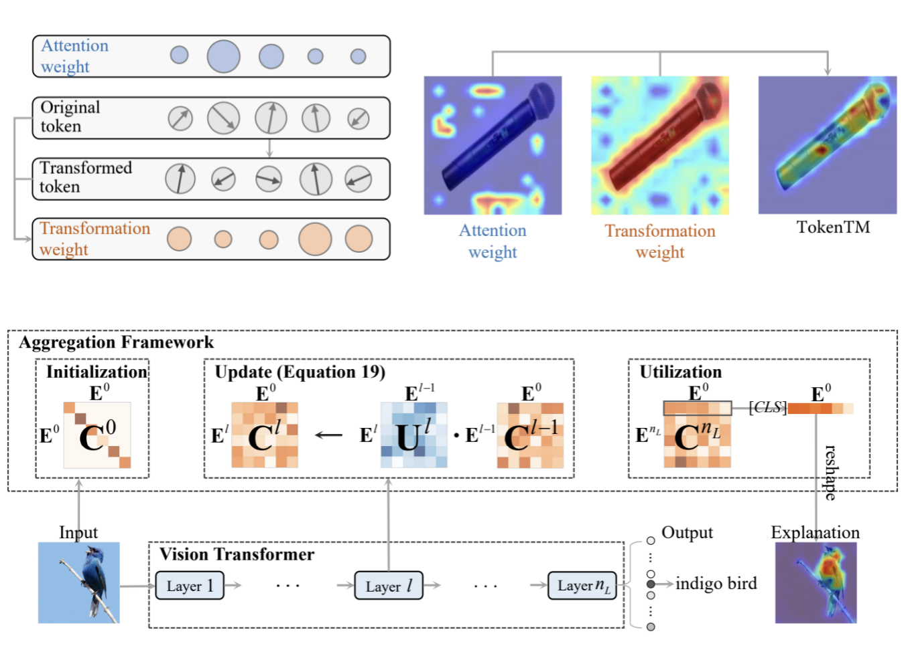

<h1 id="publications"></h1>

<h2 style="margin: 60px 0px -15px;">Publications <temp style="font-size:15px;">[</temp><a href="https://scholar.google.com/citations?user=Akua_xUAAAAJ&hl=zh-CN" target="_blank" style="font-size:15px;">Google Scholar</a><temp style="font-size:15px;">]</temp></h2>

<ol class="bibliography">

<li>
  

    

      
      <abbr class="badge">ACMMM 2025</abbr>
    

    

      
AttBalance: Visual Grounding with Attention-Driven Constraint Balancing

      

        Weitai Kang, Luowei Zhou, <strong><u>Junyi Wu</u></strong>, Changchang Sun, Yan Yan
         
      

      

      

      <a href="https://arxiv.org/abs/2407.03243" class="btn btn-sm z-depth-0" role="button" target="_blank" style="font-size:16px;">[Paper]  </a>
    

  

</li>

<li>
  

    

      
      <abbr class="badge">ICCV 2025</abbr>
    

    

      
QuEST: Low-bit Diffusion Model Quantization via Efficient Selective Finetuning

      

        Haoxuan Wang, Yuzhang Shang, Zhihang Yuan, <strong><u>Junyi Wu</u></strong>, Junchi Yan, Yan Yan
         
      

      

      

      <a href="https://arxiv.org/abs/2402.03666" class="btn btn-sm z-depth-0" role="button" target="_blank" style="font-size:16px;">[Paper]  </a>
      <a href="https://github.com/hatchetProject/QuEST" class="btn btn-sm z-depth-0" role="button" target="_blank" style="font-size:16px;">[Code]  </a>
    

  

</li>

<li>
  

    

      
      <abbr class="badge">ICCV 2025</abbr>
    

    

      
CaO2: Rectifying Inconsistencies in Diffusion-Based Dataset Distillation

      

        Haoxuan Wang, Zhenghao Zhao, <strong><u>Junyi Wu</u></strong>, Yuzhang Shang, Gaowen Liu, Yan Yan
         
      

      

      

      <a href="https://arxiv.org/abs/2506.22637v1" class="btn btn-sm z-depth-0" role="button" target="_blank" style="font-size:16px;">[Paper]  </a>
      <a href="https://github.com/hatchetProject/CaO2" class="btn btn-sm z-depth-0" role="button" target="_blank" style="font-size:16px;">[Code]  </a>
    

  

</li>

<li>
  

    

      
      <abbr class="badge">NeurIPS 2025 (Spotlight)</abbr>
    

    

      
X-Field: A Physically Grounded Representation for 3D X-ray Reconstruction

      

        Feiran Wang*, Jiachen Tao*, <strong><u>Junyi Wu</u>*</strong>, Haoxuan Wang, Bin Duan, Kai Wang, Zongxin Yang, Yan Yan
         
      

      

      

      <a href="https://arxiv.org/abs/2503.08596" class="btn btn-sm z-depth-0" role="button" target="_blank" style="font-size:16px;">[Paper]  </a>
      <a href="https://github.com/Brack-Wang/X-Field" class="btn btn-sm z-depth-0" role="button" target="_blank" style="font-size:16px;">[Code]  </a>
      <a href="https://brack-wang.github.io/XField/" class="btn btn-sm z-depth-0" role="button" target="_blank" style="font-size:16px;">[Project]  </a>
    

  

</li>

<li>
  

    

      
      <abbr class="badge">NeurIPS 2024</abbr>
    

    

      
PTQ4DiT: Post-training Quantization for Diffusion Transformers

      

        <strong><u>Junyi Wu</u>*</strong>, Haoxuan Wang*, Yuzhang Shang, Mubarak Shah, Yan Yan
         
      

      

      

      <a href="https://arxiv.org/abs/2405.16005" class="btn btn-sm z-depth-0" role="button" target="_blank" style="font-size:16px;">[Paper]  </a>
      <a href="https://github.com/adreamwu/PTQ4DiT" class="btn btn-sm z-depth-0" role="button" target="_blank" style="font-size:16px;">[Code]  </a>
    

  

</li>

<li>
  

    

      
      <abbr class="badge">ECCV 2024</abbr>
    

    

      
Dataset Quantization with Active Learning based Adaptive Sampling

      

        Zhenghao Zhao, Yuzhang Shang, <strong><u>Junyi Wu</u></strong>, Yan Yan
         
      

      

      

      <a href="https://arxiv.org/abs/2407.07268" class="btn btn-sm z-depth-0" role="button" target="_blank" style="font-size:16px;">[Paper]  </a>
      <a href="https://github.com/ichbill/DQAS" class="btn btn-sm z-depth-0" role="button" target="_blank" style="font-size:16px;">[Code]  </a>
    

  

</li>

<li>
  

    

      
      <abbr class="badge">CVPR 2024</abbr>
    

    

      
On the Faithfulness of Vision Transformer Explanations

      

        <strong><u>Junyi Wu</u></strong>, Weitai Kang, Hao Tang, Yuan Hong, Yan Yan
         
      

      

      

      <a href="https://arxiv.org/abs/2404.01415" class="btn btn-sm z-depth-0" role="button" target="_blank" style="font-size:16px;">[Paper]  </a>
      <a href="https://github.com/adreamwu/SaCo" class="btn btn-sm z-depth-0" role="button" target="_blank" style="font-size:16px;">[Code]  </a>
    

  

</li>

<li>
  

    

      
      <abbr class="badge">CVPR 2024</abbr>
    

    

      
Token Transformation Matters: Towards Faithful Post-hoc Explanation for Vision Transformer

      

        <strong><u>Junyi Wu</u></strong>, Bin Duan, Weitai Kang, Hao Tang, Yan Yan
         
      

      

      

      <a href="https://arxiv.org/abs/2403.14552" class="btn btn-sm z-depth-0" role="button" target="_blank" style="font-size:16px;">[Paper]  </a>
    

  

</li>

